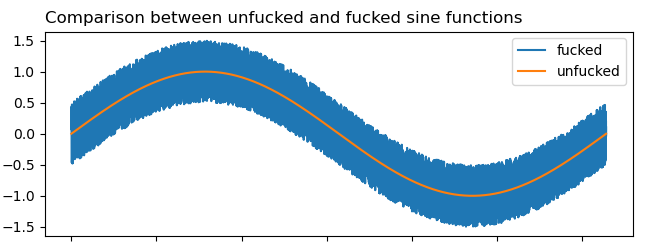

*Fucks with your sine table just because*

# Sine Table Fucker

Just totally fucks with your sine table, making every trigonometry function return a totally absurd value, which messes with your game.

**Flashing lights warning**

## Installation

Simply download the latest version straight from our [Modrinth page](https://modrinth.com/project/sine-table-fucker). It should load on Minecraft 1.20, using Fabric or Quilt.

## What does it actually do?

A good chunk of the maths performed by the game will just randomly jump between values, including your walking and attacking direction. It will also mess up anything animated and a bunch of other things.

Just try it out! Beware it will cause the sky light level to flash between values and can cause some discomfort for some people. If that's something you are sensitive to, just fly into a cave.

## *Why?*

Awful idea suggested by [@LambdAurora](https://modrinth.com/user/LambdAurora) and I had to go for it.

## Can I get a port to X?

Yes! You can subject me to any torture in the form of making me port the mod to a version and loader of your choosing, including whatever cursed things you may think of, if you [donate at least 25€ here](https://www.thetrevorproject.org/).

## How can I contribute?

I, uh, *looks around*. There isn't much to contribute? But if you have a penny to spare, you can contribute to [the Trevor project](https://www.thetrevorproject.org/) instead!